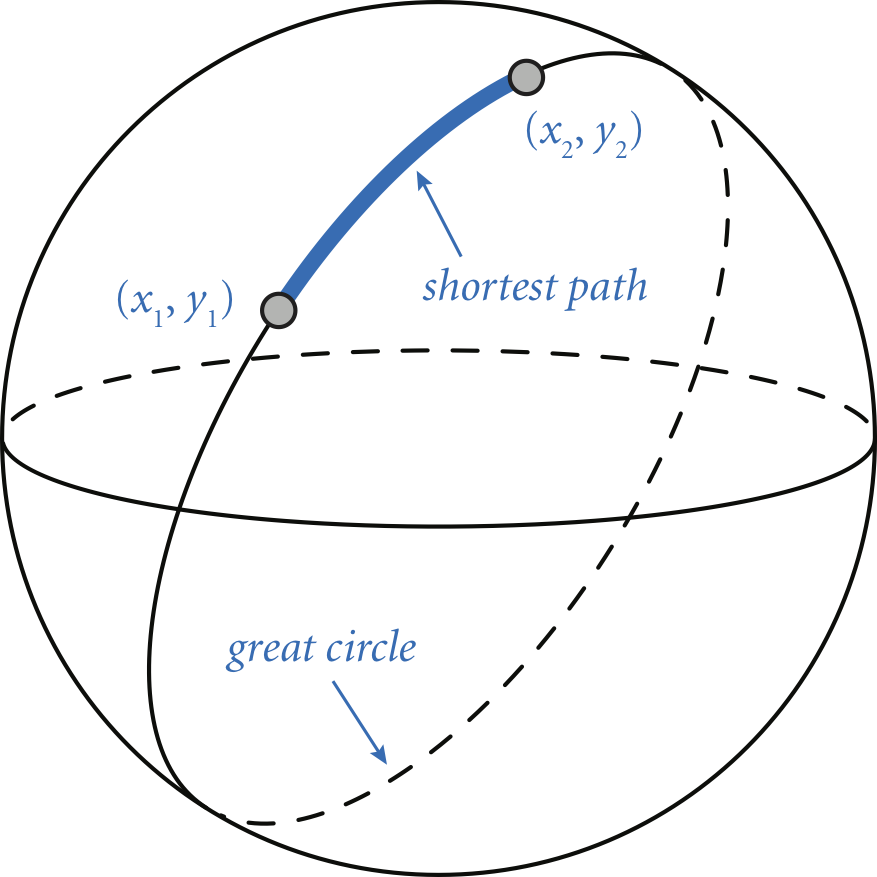

The [great-circle distance](https://en.wikipedia.org/wiki/Great-circle_distance){:target="_blank" rel="noopener"}
is the length of the shortest path between two points (x1, y1) and (x2, y2) on 
the surface of a sphere, where the path is constrained to be along the surface.

<br/>

Write a program GreatCircle.java that takes four double command-line 
arguments x1, y1, x2, and y2 — the latitude and longitude (in degrees) 
of two points on the surface of the earth — and prints the great-circle 
distance (in kilometers) between them. Use the following 
[Haversine formula](https://en.wikipedia.org/wiki/Haversine_formula){:target="_blank" rel="noopener"}

&nbsp;&nbsp;&nbsp;&nbsp;distance = 2_r_ arcsin(sqrt(sin<sup>2</sup>((x<sub>2</sub> - x<sub>1</sub>)/2) + cos x<sub>1</sub> cos x<sub>2</sub> sin<sup>2</sup>((y<sub>2</sub> - y<sub>1</sub>)/2)))

where r = 6,371.0 is the mean radius of the Earth (in kilometers).

```
~/Desktop/hello> javac GreatCircle.java

~/Desktop/hello> java GreatCircle 40.35 74.65 48.87 -2.33    // Princeton to Paris
5902.927099258561 kilometers

~/Desktop/hello> java GreatCircle 60.0 15.0 120.0 105.0      // for debugging
4604.53989281927 kilometers
```

Hint: The command-line arguments are given in degrees but Java’s trigonometric 
functions use radians. Use _Math.toRadians()_ to convert from degrees to 
radians.

Although the Earth is not a perfect sphere, this formula is a good 
approximation to the true distance.

##### Note: the above description is copied from [Coursera](https://coursera.cs.princeton.edu/introcs/assignments/hello/specification.php){:target="_blank" rel="noopener"} and converted to markdown for convenience

### Solution:
```java
public class GreatCircle {

    public static void main(String[] args) {
        final double x1 = Math.toRadians(Double.parseDouble(args[0]));
        final double y1 = Math.toRadians(Double.parseDouble(args[1]));
        final double x2 = Math.toRadians(Double.parseDouble(args[2]));
        final double y2 = Math.toRadians(Double.parseDouble(args[3]));

        final double sin2x = Math.sin((x2 - x1) / 2);
        final double sin2y = Math.sin((y2 - y1) / 2);
        final double twor = 2 * 6371.0;

        final double distance =
                twor * Math.asin(Math.sqrt(
                        (sin2x * sin2x) + (Math.cos(x1) * Math.cos(x2) * (sin2y * sin2y))));
        System.out.println(distance + " kilometers");
    }
}
``` 
Link To: [Java Source Code](https://github.com/eddycyu/programming-with-a-purpose/blob/master/src/GreatCircle.java){:target="_blank" rel="noopener"}
