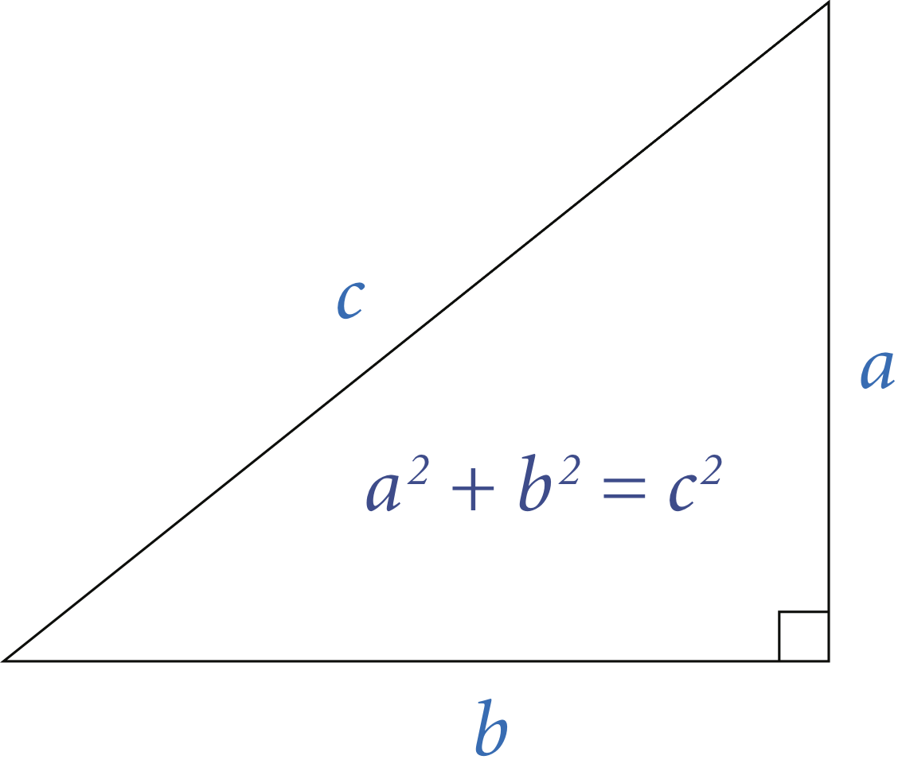

Write a program RightTriangle that takes three integer command-line arguments 
and determines whether they constitute the side lengths of some right triangle.

<br/>

The following two conditions are necessary and sufficient:
* Each integer must be positive.
* The sum of the squares of two of the integers must equal the square of the 
  third integer.

```
~/Desktop/hello> javac RightTriangle.java

~/Desktop/hello> java RightTriangle 3 4 5
true

~/Desktop/hello> java RightTriangle 13 12 5
true

~/Desktop/hello> java RightTriangle 1 2 3
false

~/Desktop/hello> java RightTriangle -3 4 -5
false
```

##### Note: the above description is copied from [Coursera](https://coursera.cs.princeton.edu/introcs/assignments/hello/specification.php){:target="_blank" rel="noopener"} and converted to markdown for convenience

### Solution:
```java
public class RightTriangle {

    public static void main(String[] args) {
        // use long instead of int to handle overflow
        final long a = Long.parseLong(args[0]);
        final long b = Long.parseLong(args[1]);
        final long c = Long.parseLong(args[2]);

        final long a2 = a * a;
        final long b2 = b * b;
        final long c2 = c * c;

        final boolean result = (a > 0) && (b > 0) && (c > 0)
                && ((a2 + b2 == c2) || (a2 + c2 == b2) || (b2 + c2 == a2));
        System.out.println(result);
    }
}
``` 
Link To: [Java Source Code](https://github.com/eddycyu/programming-with-a-purpose/blob/master/src/RightTriangle.java){:target="_blank" rel="noopener"}
