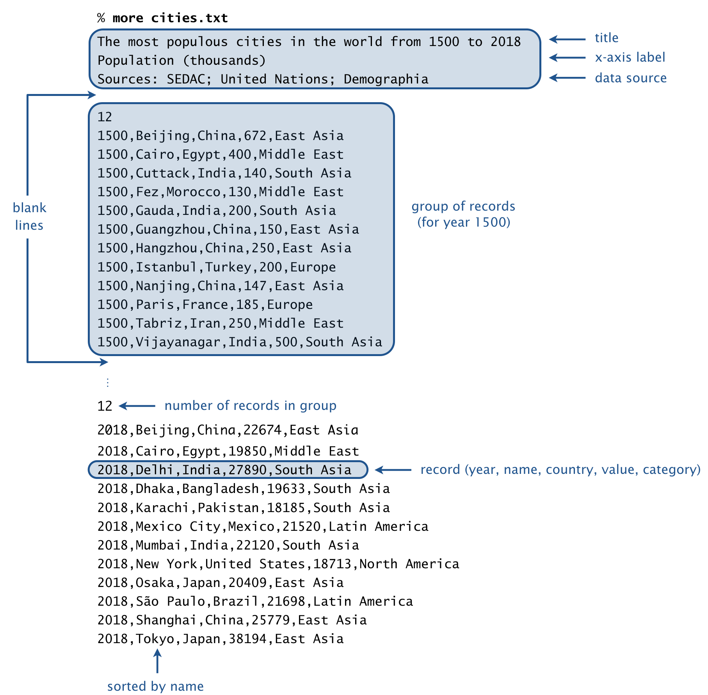

Write a program to produce animated bar charts, using 
[BarChart.java](https://github.com/eddycyu/programming-with-a-purpose/blob/master/src/BarChart.java){:target="_blank" rel="noopener"}
to draw static bar charts. As a canonical example, consider an animated bar 
chart of the 10 most populous cities in the world, from 1500 to 2018. To 
produce the visualization, you will successively draw 519 individual bar charts 
(one per year of data), with a short pause between each drawing. Each bar chart 
contains the 10 most populous cities in that year, arranged in descending order 
of population.

_File format._ A bar-chart-racer data file is organized as a sequence of lines. 
The first three lines comprise the header:
* The _title_.
* The _x-axis label_.
* The _source_ of the data.

Following the header is a blank line, followed by the raw data. Each line (or 
record) consists of 5 fields, separated by commas:
* The _year_ or _date_ (e.g, 2018).
* The _name_ (e.g., Mumbai).
* The associated _country_ (e.g., India).
* The _value_ (e.g, 22120).
* The _category_ (e.g., South Asia).

The _value_ field is an integer; the other fields can be arbitrary strings 
(except that they can’t contain commas or newlines).

Records corresponding to the same year (or time period) are grouped together. A 
group of records consists of an integer _n_, followed by _n_ records. Within a 
group, the records are sorted by name. A blank line separates each group.

<br/>

_Data files._ We supply a number of fascinating data files in the specified 
format, curated from various sources.


input file	 | description       | period             |data source
-------------|-------------------|--------------------|-------------
[cities.txt](https://github.com/eddycyu/programming-with-a-purpose/blob/master/data/cities.txt){:target="_blank" rel="noopener"} | most populous cities in the world | 1500–2018 | [John Burn-Murdoch](https://observablehq.com/@johnburnmurdoch/bar-chart-race-the-most-populous-cities-in-the-world){:target="_blank" rel="noopener"}
[countries.txt](https://github.com/eddycyu/programming-with-a-purpose/blob/master/data/countries.txt){:target="_blank" rel="noopener"} | most populous countries in the world | 1950–2100 | [United Nations](https://population.un.org/wpp/Download/Standard/Population/){:target="_blank" rel="noopener"}
[cities-usa.txt](https://github.com/eddycyu/programming-with-a-purpose/blob/master/data/cities-usa.txt){:target="_blank" rel="noopener"} | most populous cities in the U.S. | 1790-2018 | [U.S. Census Bureau](https://data.census.gov/cedsci/){:target="_blank" rel="noopener"}
[brands.txt](https://github.com/eddycyu/programming-with-a-purpose/blob/master/data/brands.txt){:target="_blank" rel="noopener"} | most valuable brands in the world | 2000–2018 | [Interbrand](https://www.interbrand.com/best-brands/best-global-brands/2018/){:target="_blank" rel="noopener"}
[movies.txt](https://github.com/eddycyu/programming-with-a-purpose/blob/master/data/movies.txt){:target="_blank" rel="noopener"} | highest-grossing movies in the U.S. | 1982–2019 | [Box Office Mojo](https://www.boxofficemojo.com/){:target="_blank" rel="noopener"}
[baby-names.txt](https://github.com/eddycyu/programming-with-a-purpose/blob/master/data/baby-names.txt){:target="_blank" rel="noopener"} | most popular baby names in the U.S. | 1880–2018 | [U.S. Social Security](https://catalog.data.gov/dataset/baby-names-from-social-security-card-applications-national-level-data){:target="_blank" rel="noopener"}
[football.txt](https://github.com/eddycyu/programming-with-a-purpose/blob/master/data/football.txt){:target="_blank" rel="noopener"} | the best football clubs in Europe | 1960–2019 | [clubelo.com](http://clubelo.com/API){:target="_blank" rel="noopener"}
[endgame.txt](https://github.com/eddycyu/programming-with-a-purpose/blob/master/data/endgame.txt){:target="_blank" rel="noopener"} | characters in Endgame by screen time | Minute 1–170 | [Prashant](https://www.youtube.com/watch?v=uSj8hMA3lY8&feature=youtu.be){:target="_blank" rel="noopener"}
[infinity-war.txt](https://github.com/eddycyu/programming-with-a-purpose/blob/master/data/infinity-war.txt){:target="_blank" rel="noopener"} | characters in Infinity War by screen time | Minute 1–132 | [Prashant](https://www.youtube.com/watch?v=uSj8hMA3lY8&feature=youtu.be){:target="_blank" rel="noopener"}
[trademarks.txt](https://github.com/eddycyu/programming-with-a-purpose/blob/master/data/trademarks.txt){:target="_blank" rel="noopener"} | trademarks granted by country | 1980–2018 | [WIPO](https://www.wipo.int/portal/en/index.html){:target="_blank" rel="noopener"}
[patents.txt](https://github.com/eddycyu/programming-with-a-purpose/blob/master/data/patents.txt){:target="_blank" rel="noopener"} | patents granted by country | 1980–2018 | [WIPO](https://www.wipo.int/portal/en/index.html){:target="_blank" rel="noopener"}


_Soundtrack (optional)._ If you would like a musical accompaniment to your 
animated bar chart, add the following line at the beginning of your program:
```java
StdAudio.loop("soundtrackA.wav");
```

Feel free to substitute a different .wav file.

_Command-line arguments._ The program takes two command-line arguments: the 
name of a bar-chart-racer file and an integer _k_ that specifies how many bars 
to display in each bar chart. Here are some sample executions:

```
~/Desktop/barchart> java BarChartRacer cities.txt 10
```
Link To: [cities output](https://coursera.cs.princeton.edu/introcs/assignments/barchart/cities.mp4){:target="_blank" rel="noopener"}
```
~/Desktop/barchart> java BarChartRacer brands.txt 15
```
Link To: [brands output](https://coursera.cs.princeton.edu/introcs/assignments/barchart/brands.mp4){:target="_blank" rel="noopener"}
```
~/Desktop/barchart> java BarChartRacer movies.txt 10
```
Link To: [movies output](https://coursera.cs.princeton.edu/introcs/assignments/barchart/movies.mp4){:target="_blank" rel="noopener"}
```
~/Desktop/barchart> java BarChartRacer endgame.txt 10
```
Link To: [endgame output](https://coursera.cs.princeton.edu/introcs/assignments/barchart/endgame.mov){:target="_blank" rel="noopener"}

##### Note: the above description is copied from [Coursera](https://coursera.cs.princeton.edu/introcs/assignments/barchart/specification.php){:target="_blank" rel="noopener"} and converted to markdown for convenience

### Solution:
```java
public class BarChartRacer {

    private static void readGroup(In file, int k, BarChart chart) {
        final int n = Integer.parseInt(file.readLine());
        final Bar[] bars = new Bar[n];
        for (int i = 0; i < n; i++) {
            final String line = file.readLine();
            final String[] tokens = line.split(",");
            final String year = tokens[0];
            final String name = tokens[1];
            // final String country = tokens[2];
            final int value = Integer.parseInt(tokens[3]);
            final String category = tokens[4];
            bars[i] = new Bar(name, value, category);
            chart.setCaption(year);
        }
        Arrays.sort(bars);
        int count = 0;
        for (int i = bars.length - 1; (i >= 0) && (count < k); i--) {
            final Bar bar = bars[i];
            chart.add(bar.getName(), bar.getValue(), bar.getCategory());
            count++;
        }
    }

    public static void main(String[] args) {
        final int k = Integer.parseInt(args[1]);
        final In file = new In(args[0]);
        final String title = file.readLine();
        final String xAxisLabel = file.readLine();
        final String dataSource = file.readLine();
        // StdAudio.loop("soundtrackA.wav");
        StdDraw.setCanvasSize(1000, 700);
        StdDraw.enableDoubleBuffering();
        BarChart chart = new BarChart(title, xAxisLabel, dataSource);
        while (file.hasNextLine()) {
            chart.reset();
            StdDraw.clear();
            file.readLine();
            readGroup(file, k, chart);
            chart.draw();
            StdDraw.show();
            StdDraw.pause(100);
        }
        file.close();
        // StdAudio.close();
    }
}
``` 
Link To: [Java Source Code](https://github.com/eddycyu/programming-with-a-purpose/blob/master/src/BarChartRacer.java){:target="_blank" rel="noopener"}
