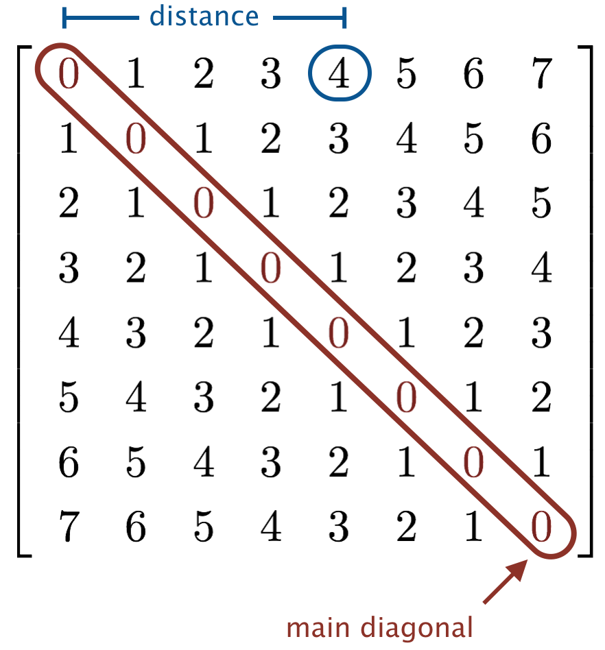

Write a program BandMatrix.java that takes two integer command-line arguments 
_n_ and _width_ and prints an _n-by-n_ pattern like the ones below, with a 
zero (0) for each element whose distance from the main diagonal is strictly 
more than width, and an asterisk (*) for each entry that is not, and two 
spaces between each 0 or *. 



Here, _distance_ means the minimum number of cells you have to move (either 
left, right, up, or down) to reach any element on the main diagonal.

```
~/Desktop/loops> java BandMatrix 8 0
*  0  0  0  0  0  0  0  
0  *  0  0  0  0  0  0  
0  0  *  0  0  0  0  0  
0  0  0  *  0  0  0  0  
0  0  0  0  *  0  0  0  
0  0  0  0  0  *  0  0  
0  0  0  0  0  0  *  0  
0  0  0  0  0  0  0  *  

~/Desktop/loops> java BandMatrix 8 1
*  *  0  0  0  0  0  0  
*  *  *  0  0  0  0  0  
0  *  *  *  0  0  0  0  
0  0  *  *  *  0  0  0  
0  0  0  *  *  *  0  0  
0  0  0  0  *  *  *  0  
0  0  0  0  0  *  *  *  
0  0  0  0  0  0  *  * 

~/Desktop/loops> java BandMatrix 8 2
*  *  *  0  0  0  0  0  
*  *  *  *  0  0  0  0  
*  *  *  *  *  0  0  0  
0  *  *  *  *  *  0  0  
0  0  *  *  *  *  *  0  
0  0  0  *  *  *  *  *  
0  0  0  0  *  *  *  *  
0  0  0  0  0  *  *  *  

~/Desktop/loops> java BandMatrix 8 3
*  *  *  *  0  0  0  0  
*  *  *  *  *  0  0  0  
*  *  *  *  *  *  0  0  
*  *  *  *  *  *  *  0  
0  *  *  *  *  *  *  *  
0  0  *  *  *  *  *  *  
0  0  0  *  *  *  *  *  
0  0  0  0  *  *  *  *  
```

Note: you may assume that _n_ and _width_ are non-negative integer.

Band matrices are matrices whose nonzero entries are restricted to a diagonal 
band. They arise frequently in numerical linear algebra.

##### Note: the above description is copied from [Coursera](https://coursera.cs.princeton.edu/introcs/assignments/loops/specification.php){:target="_blank" rel="noopener"} and converted to markdown for convenience

### Solution:
```java
public class BandMatrix {

    public static void main(String[] args) {
        final int n = Integer.parseInt(args[0]);
        final int width = Integer.parseInt(args[1]);
        for (int y = 0; y < n; y++) {
            for (int x = 0; x < n; x++) {
                if (Math.abs(x - y) > width) {
                    if (x == 0) {
                        System.out.print("0");
                    } else {
                        System.out.print("  0");
                    }
                } else {
                    if (x == 0) {
                        System.out.print("*");
                    } else {
                        System.out.print("  *");
                    }
                }
            }
            System.out.println();
        }
    }
}
``` 
Link To: [Java Source Code](https://github.com/eddycyu/programming-with-a-purpose/blob/master/src/BandMatrix.java){:target="_blank" rel="noopener"}
