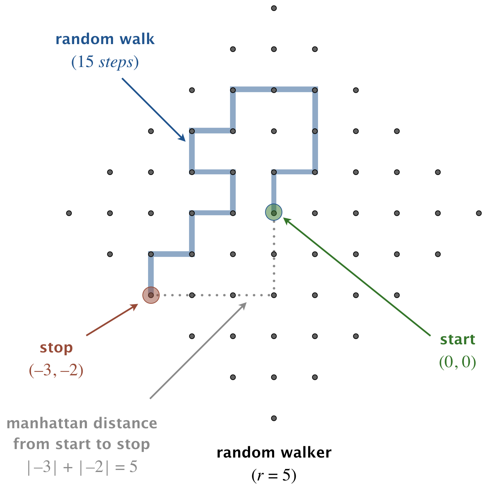

A Java programmer begins walking aimlessly. At each time step, she takes one 
step in a random direction (either north, east, south, or west), each with 
probability 25%. She stops once she is at Manhattan distance _r_ from the 
starting point. How many steps will the random walker take? This process is 
known as a two-dimensional random walk. 



Write a program RandomWalker.java that takes an integer command-line argument 
_r_ and simulates the motion of a random walk until the random walker is at 
Manhattan distance _r_ from the starting point. Print the coordinates at each 
step of the walk (including the starting and ending points), treating the 
starting point as (0, 0). Also, print the total number of steps taken.

```
~/Desktop/loops> java RandomWalker 5
(0, 0)
(0, 1)
(1, 1)
(1, 2)
(1, 3)
(0, 3)
(-1, 3)
(-1, 2)
(-2, 2)
(-2, 1)
(-1, 1)
(-1, 0)
(-2, 0)
(-2, -1)
(-3, -1)
(-3, -2)
steps = 15
```

This process is a discrete version of a natural phenomenon known as Brownian 
motion. It serves as a scientific model for an astonishing range of physical 
processes from the dispersion of ink flowing in water, to the formation of 
polymer chains in chemistry, to cascades of neurons firing in the brain.

##### Note: the above description is copied from [Coursera](https://coursera.cs.princeton.edu/introcs/assignments/loops/specification.php){:target="_blank" rel="noopener"} and converted to markdown for convenience

### Solution:
```java
public class RandomWalker {

    public static void main(String[] args) {
        final int r = Integer.parseInt(args[0]);

        // output starting position
        int x = 0;
        int y = 0;
        System.out.println("(" + x + "," + y + ")");

        double random = 0.0;
        int steps = 0;
        int distance = 0;
        while (distance != r) {
            random = Math.random();
            if (random < 0.25) {
                x -= 1;
            } else if (random < 0.50) {
                x += 1;
            } else if (random < 0.75) {
                y -= 1;
            } else {
                y += 1;
            }
            steps++;

            // output new position
            System.out.println("(" + x + "," + y + ")");

            // calculate new manhattan distance
            distance = Math.abs(x) + Math.abs(y);
        }
        System.out.println("steps = " + steps);
    }
}
``` 
Link To: [Java Source Code](https://github.com/eddycyu/programming-with-a-purpose/blob/master/src/RandomWalker.java){:target="_blank" rel="noopener"}
