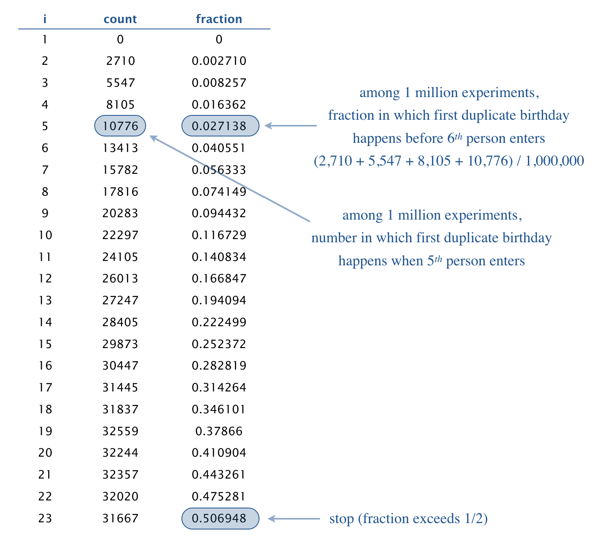

Suppose that people enter a room one at a time. How many people must enter 
until two share a birthday? Counterintuitively, after 23 people enter the room, 
there is approximately a 50–50 chance that two share a birthday. This 
phenomenon is known as the [birthday problem](https://en.wikipedia.org/wiki/Birthday_problem){:target="_blank" rel="noopener"}
or birthday paradox.

Write a program Birthday.java that takes two integer command-line arguments 
_n_ and _trials_ and performs the following experiment, _trials_ times:

* Choose a birthday for the next person, uniformly at random between 0 and _n_ − 1.
* Have that person enter the room.
* If that person shares a birthday with someone else in the room, stop; 
  otherwise repeat. 

In each experiment, count the number of people that enter the room. Print a 
table that summarizes the results (the count _i_, the number of times that 
exactly _i_ people enter the room, and the fraction of times that _i_ or 
fewer people enter the room) for each possible value of _i_ from 1 until the 
fraction reaches (or exceeds) 50%. 



```
~/Desktop/arrays> java Birthday 365 1000000
1	0	0.0
2	2710	0.00271
3	5547	0.008257
4	8105	0.016362
5	10776	0.027138
6	13413	0.040551
7	15782	0.056333
8	17816	0.074149
9	20283	0.094432
10	22297	0.116729
11	24105	0.140834
12	26013	0.166847
13	27247	0.194094
14	28405	0.222499
15	29873	0.252372
16	30447	0.282819
17	31445	0.314264
18	31837	0.346101
19	32559	0.37866
20	32244	0.410904
21	32357	0.443261
22	32020	0.475281
23	31667	0.506948

~/Desktop/arrays> java Birthday 31 1000000
1	0	0.0
2	32270	0.03227
3	62580	0.09485
4	87582	0.182432
5	105596	0.288028
6	114427	0.402455
7	115494	0.517949
```

The birthday problem arises in many computer science applications, including 
hashing, cryptographic attacks, and testing random number generators. 

##### Note: the above description is copied from [Coursera](https://coursera.cs.princeton.edu/introcs/assignments/arrays/specification.php){:target="_blank" rel="noopener"} and converted to markdown for convenience

### Solution:
```java
public class Birthday {

    public static void main(String[] args) {
        final int n = Integer.parseInt(args[0]);
        final int trials = Integer.parseInt(args[1]);

        // note: at most n+1 people will enter a room before encountering
        // a pair that shares the same birthday; hence need to try up to
        // n+1 instead of n
        final int[] count = new int[n+1];
        for (int t = 0; t < trials; t++) {
            final boolean[] seenBirthday = new boolean[n];
            for (int nextPerson = 0; nextPerson < count.length; nextPerson++) {
                int birthday = (int) (Math.random() * n);
                // check if any person in the room has the same birthday as the next person
                if (seenBirthday[birthday]) {
                    count[nextPerson]++;
                    break;
                }
                seenBirthday[birthday] = true;
            }
        }

        // compute fraction and output
        final double[] fraction = new double[count.length];
        System.out.println(1 + "\t" + count[0] + "\t" + fraction[0]);
        for (int i = 1; i < count.length; i++) {
            double sum = 0.0;
            for (int j = 1; j <= i; j++) {
                sum += count[j];
            }
            fraction[i] = sum / trials;
            System.out.println(i + 1 + "\t" + count[i] + "\t" + fraction[i]);
            if (fraction[i] >= 0.5) {
                break;
            }
        }
    }
}
```
 Link To: [Java Source Code](https://github.com/eddycyu/programming-with-a-purpose/blob/master/src/Birthday.java){:target="_blank" rel="noopener"}
