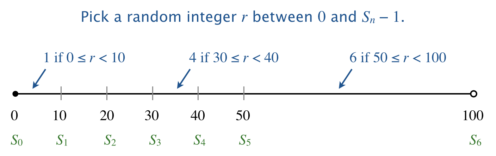

Write a program DiscreteDistribution.java that takes an integer command-line 
argument _m_, followed by a sequence of positive integer command-line 
arguments _a<sub>1</sub>, a<sub>2</sub>, ..., a<sub>n</sub>_, and prints _m_ 
random indices (separated by whitespace), choosing each index _i_ with 
probability proportional to _a<sub>i</sub>_.

```
~/Desktop/arrays> java DiscreteDistribution 25 1 1 1 1 1 1
5 2 4 4 5 5 4 3 4 3 1 5 2 4 2 6 1 3 6 2 3 2 4 1 4

~/Desktop/arrays> java DiscreteDistribution 25 10 10 10 10 10 50
3 6 6 1 6 6 2 4 6 6 3 6 6 6 6 4 5 6 2 2 6 6 2 6 2

~/Desktop/arrays> java DiscreteDistribution 25 80 20
1 2 1 2 1 1 2 1 1 1 1 1 1 1 1 2 2 2 1 1 1 1 1 1 1 

~/Desktop/arrays> java DiscreteDistribution 100 301 176 125 97 79 67 58 51 46
6 2 4 3 2 3 3 1 7 1 1 3 4 7 1 4 2 2 1 1 3 1 8 6 2 
1 3 6 1 8 5 1 3 6 1 1 2 3 8 7 4 6 4 3 1 5 3 3 7 3 
1 3 1 7 7 2 2 3 6 5 4 1 1 1 7 2 3 5 2 2 1 4 1 2 1 
2 1 2 2 3 2 8 4 3 2 1 8 3 5 3 3 8 1 2 3 3 1 2 3 1
```

To generate a random index _i_ with probability proportional to _a<sub>i</sub>_:

* Define the cumulative sums _S<sub>i</sub> = a<sub>1</sub> + a<sub>2</sub> + ... + a<sub>i</sub>_ and _S<sub>0</sub>_ = 0.
* Pick a random integer _r_ uniformly between 0 and _S<sub>n</sub>_ − 1.
* Find the unique index _i_ between 1 and _n_ such that _S<sub>i-1</sub>_ ≤ _r_ < _S<sub>i</sub>_.

Geometrically, this subdivides the interval [0,_S<sub>n</sub>_) into _n_ 
subintervals [_S<sub>i−1</sub>,S<sub>i</sub>_), with the length of 
subinterval _i_ proportional to _a<sub>i</sub>_. For example, if the discrete 
distribution is defined by

&nbsp;&nbsp;&nbsp;&nbsp;(_a<sub>1</sub>, a<sub>2</sub>, a<sub>3</sub>, a<sub>4</sub>, a<sub>5</sub>, a<sub>6</sub>_) = (10, 10, 10, 10, 10, 50),

then the cumulative sums are

&nbsp;&nbsp;&nbsp;&nbsp;(_S<sub>1</sub>, S<sub>2</sub>, S<sub>3</sub>, S<sub>4</sub>, S<sub>5</sub>, S<sub>6</sub>_) = (10, 20, 30, 40, 50, 100)

and the following diagram illustrates the 6 subintervals:



In probability theory, this is known as sampling from a discrete distribution.

##### Note: the above description is copied from [Coursera](https://coursera.cs.princeton.edu/introcs/assignments/arrays/specification.php){:target="_blank" rel="noopener"} and converted to markdown for convenience

### Solution:
```java
public class DiscreteDistribution {

    public static void main(String[] args) {
        final int m = Integer.parseInt(args[0]);

        // read sequence of positive integer command-line arguments
        final int n = args.length - 1;
        final int[] a = new int[n];
        for (int i = 0; i < a.length; i++) {
            a[i] = Integer.parseInt(args[i + 1]);
        }

        // define the cumulative sums
        final int[] sum = new int[a.length + 1];
        sum[0] = 0;
        for (int i = 0; i < a.length; i++) {
            sum[i + 1] = sum[i] + a[i];
        }

        int count = 0;
        for (int i = 0; i < m; i++) {
            // pick a random integer r uniformly between 0 and Sn - 1
            // double r = Math.random() * (sum[n] - 1);
            final double r = Math.random() * (sum[n]);
            // find the unique index i between 1 and n such that Si-1<=r<Si
            for (int j = 0; j < sum.length; j++) {
                if (r < sum[j]) {
                    System.out.print(j + " ");
                    count++;
                    if (count == 25) {
                        System.out.println();
                        count = 0;
                    }
                    break;
                }
            }
        }
    }
}
``` 
Link: [Java Code](https://github.com/eddycyu/programming-with-a-purpose/blob/master/src/DiscreteDistribution.java){:target="_blank" rel="noopener"}
