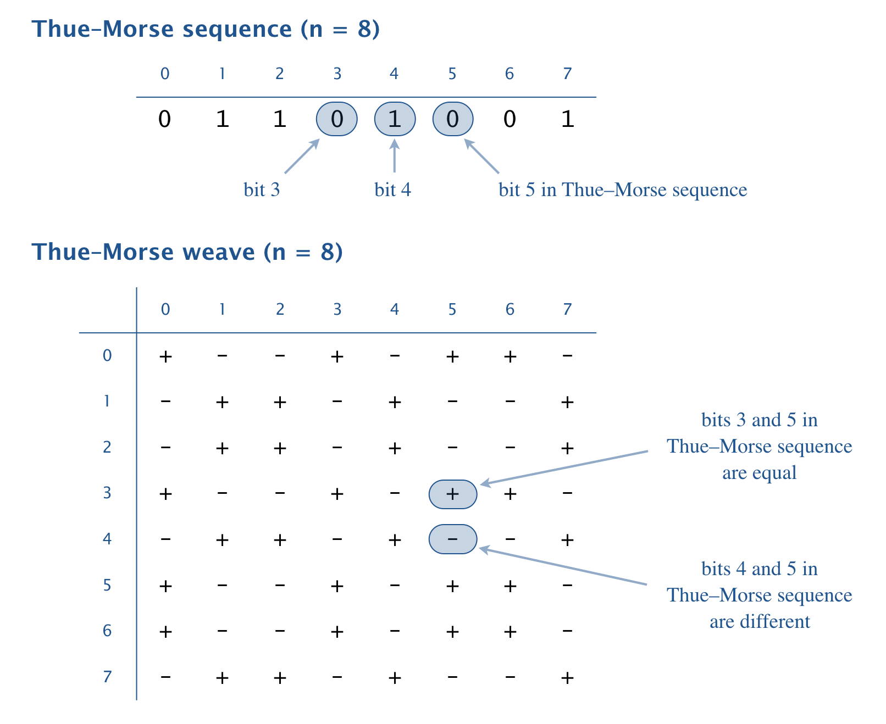

Write a program ThueMorse.java that takes an integer command-line argument 
_n_ and prints an _n-by-n_ pattern like the ones below. Include two space 
characters between each + and - character.

```
~/Desktop/arrays> java ThueMorse 4
+  -  -  +
-  +  +  -
-  +  +  -
+  -  -  +

~/Desktop/arrays> java ThueMorse 8
+  -  -  +  -  +  +  -
-  +  +  -  +  -  -  +
-  +  +  -  +  -  -  +
+  -  -  +  -  +  +  -
-  +  +  -  +  -  -  +
+  -  -  +  -  +  +  -
+  -  -  +  -  +  +  -
-  +  +  -  +  -  -  +

~/Desktop/arrays> java ThueMorse 16
+  -  -  +  -  +  +  -  -  +  +  -  +  -  -  +
-  +  +  -  +  -  -  +  +  -  -  +  -  +  +  -
-  +  +  -  +  -  -  +  +  -  -  +  -  +  +  -
+  -  -  +  -  +  +  -  -  +  +  -  +  -  -  +
-  +  +  -  +  -  -  +  +  -  -  +  -  +  +  -
+  -  -  +  -  +  +  -  -  +  +  -  +  -  -  +
+  -  -  +  -  +  +  -  -  +  +  -  +  -  -  +
-  +  +  -  +  -  -  +  +  -  -  +  -  +  +  -
-  +  +  -  +  -  -  +  +  -  -  +  -  +  +  -
+  -  -  +  -  +  +  -  -  +  +  -  +  -  -  +
+  -  -  +  -  +  +  -  -  +  +  -  +  -  -  +
-  +  +  -  +  -  -  +  +  -  -  +  -  +  +  -
+  -  -  +  -  +  +  -  -  +  +  -  +  -  -  +
-  +  +  -  +  -  -  +  +  -  -  +  -  +  +  -
-  +  +  -  +  -  -  +  +  -  -  +  -  +  +  -
+  -  -  +  -  +  +  -  -  +  +  -  +  -  -  +
```

The [Thue-Morse sequence](https://en.wikipedia.org/wiki/Thue%E2%80%93Morse_sequence){:target="_blank" rel="noopener"}
is an infinite sequence of 0s and 1s that is constructed by starting with 0 
and successively appending the bitwise negation (interchange 0s and 1s) of the 
existing sequence. Here are the first few steps of this construction: 

&nbsp;&nbsp;&nbsp;&nbsp;__0__<br/>
&nbsp;&nbsp;&nbsp;&nbsp;0 __1__<br/>
&nbsp;&nbsp;&nbsp;&nbsp;0 1 __1 0__<br/>
&nbsp;&nbsp;&nbsp;&nbsp;0 1 1 0 __1 0 0 1__<br/>
&nbsp;&nbsp;&nbsp;&nbsp;0 1 1 0 1 0 0 1 __1 0 0 1 0 1 1 0__

To visualize the Thue–Morse sequence, create an _n-by-n_ pattern by printing a + 
(plus sign) in row _i_ and column _j_ if bits _i_ and _j_ in the sequence are 
equal, and a - (minus sign) if they are different. 



Note: you may assume that _n_ is a positive integer (but it need not be a power
of 2).

The Thue–Morse sequence has many fascinating properties and arises in graphic 
design and in music composition.

##### Note: the above description is copied from [Coursera](https://coursera.cs.princeton.edu/introcs/assignments/arrays/specification.php){:target="_blank" rel="noopener"} and converted to markdown for convenience

### Solution:
```java
public class ThueMorse {

    public static void main(String[] args) {
        final int n = Integer.parseInt(args[0]);

        // construct sequence
        final int[] sequence = new int[n];
        for (int i = 1; i < sequence.length; i = i * 2) {
            for (int j = 0; j < i; j++) {
                // skip if n is not a power of 2
                if (i + j >= n) {
                    continue;
                }

                if (sequence[j] == 0) {
                    sequence[i + j] = 1;
                } else {
                    sequence[i + j] = 0;
                }
            }
        }

        // output
        for (int i = 0; i < n; i++) {
            for (int j = 0; j < n; j++) {
                if (sequence[i] == sequence[j]) {
                    System.out.print("+  ");
                } else {
                    System.out.print("-  ");
                }
            }
            System.out.println();
        }
    }
}
``` 
Link: [Java Code](https://github.com/eddycyu/programming-with-a-purpose/blob/master/src/ThueMorse.java){:target="_blank" rel="noopener"}
