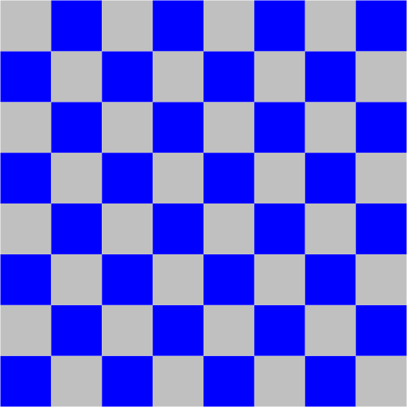
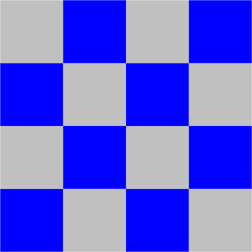
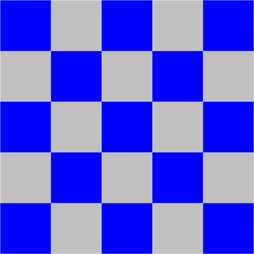

Write a program Checkerboard.java that takes a command-line integer _n_ and 
plots an _n-by-n_ checkerboard pattern to standard drawing. Color the squares 
blue and light gray, with the bottom-left square blue. To draw,

* Call _StdDraw.setScale(0, n)_ so that x- and y-coordinates of the canvas 
  range from 0 and _n_.
* Call either _StdDraw.filledSquare()_ or _StdDraw.filledPolygon()_ to draw 
  each of the _n<sup>2</sup>_ squares.
* Make sure that the squares fit snugly in the standard drawing window.
* Do not change the canvas size. 

```
~/Desktop/io> javac Checkerboard.java

~/Desktop/io> java Checkerboard 8
```


```
~/Desktop/io> java Checkerboard 4
```


```
~/Desktop/io> java Checkerboard 5
```


##### Note: the above description is copied from [Coursera](https://coursera.cs.princeton.edu/introcs/assignments/io/specification.php){:target="_blank" rel="noopener"} and converted to markdown for convenience

### Solution:
```java
public class Checkerboard {

    public static void main(String[] args) {
        final int n = Integer.parseInt(args[0]);

        StdDraw.setScale(0, n);
        for (int row = 0; row < n; row++) {
            for (int col = 0; col < n; col++) {
                if (row % 2 == 0) {
                    if (col % 2 == 0) {
                        StdDraw.setPenColor(Color.BLUE);
                    } else {
                        StdDraw.setPenColor(Color.LIGHT_GRAY);
                    }
                } else {
                    if (col % 2 == 0) {
                        StdDraw.setPenColor(Color.LIGHT_GRAY);
                    } else {
                        StdDraw.setPenColor(Color.BLUE);
                    }
                }
                StdDraw.filledSquare(col + 0.5, row + 0.5, 0.5);
            }
        }
    }
}
``` 
Link: [Java Code](https://github.com/eddycyu/programming-with-a-purpose/blob/master/src/Checkerboard.java){:target="_blank" rel="noopener"}
