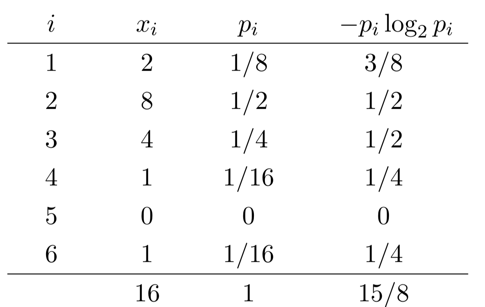

Write a program ShannonEntropy.java that takes a command-line integer _m_; 
reads a sequence of integers between 1 and _m_ from standard input; and prints 
the Shannon entropy to standard output, with 4 digits after the decimal point. 
The Shannon entropy of a sequence of integers is given by the formula:

&nbsp;&nbsp;&nbsp;&nbsp;H = -(_p<sub>1</sub>_ log<sub>2</sub> _p<sub>1</sub>_ + _p<sub>2</sub>_ log<sub>2</sub> _p<sub>2</sub>_ + ... + _p<sub>m</sub>_ log<sub>2</sub> _p<sub>m</sub>_)

where _p<sub>i</sub>_ denotes the proportion of integers whose value is _i_. If 
_p<sub>i</sub>_ = 0, then treat _p<sub>i</sub>_ log<sub>2</sub> _p<sub>i</sub>_ as 0.

```
~/Desktop/io> javac ShannonEntropy.java

~/Desktop/io> cat fair-coin.txt
1 1 1 1 2 1 2 1 1 2
2 2 2 2 1 2 1 2 2 1

~/Desktop/io> java ShannonEntropy 2 < fair-coin.txt
1.0000

~/Desktop/io> cat loaded-die.txt
3 2 6 2 4 3 2 1 2 2 1 3 2 3 2 2

~/Desktop/io> java ShannonEntropy 6 < loaded-die.txt
1.8750

~/Desktop/io> java DiscreteDistribution 1000000 80 20 | java-introcs ShannonEntropy 2
0.7221

~/Desktop/io> java DiscreteDistribution 1000000 80 20 | java-introcs ShannonEntropy 2
0.7217
```

_Step-by-step calculation._ Consider the following sequence of 16 integers 
generated from a loaded die.
```
3   2   6   2   4   3   2   1   2   2   1   3   2   3   2   2
```
This table shows the frequencies _x<sub>i</sub>_, the proportions _p<sub>i</sub>_, 
and the −_p<sub>i</sub>_ log<sub>2</sub> _p<sub>i</sub>_ terms:



The Shannon entropy is 1.875 = 15/8.

The Shannon entropy is a measure of the rate of information produced by a 
random source, such as the outcomes of flipping a fair coin or rolling a 
loaded die. It is a fundamental concept in information theory and data compression.

##### Note: the above description is copied from [Coursera](https://coursera.cs.princeton.edu/introcs/assignments/io/specification.php){:target="_blank" rel="noopener"} and converted to markdown for convenience

### Solution:
```java
public class ShannonEntropy {

    public static void main(String[] args) {
        final int m = Integer.parseInt(args[0]);

        int count = 0;
        final int[] proportions = new int[m];
        while (!StdIn.isEmpty()) {
            int number = StdIn.readInt();
            proportions[number - 1]++;
            count++;
        }

        double h = 0.0;
        double p = 0.0;
        for (int i = 0; i < proportions.length; i++) {
            if (proportions[i] != 0) {
                p = (proportions[i] / (double) count);
                // log2N = log10(N)/log10(2)
                final double a = Math.log10(p);
                final double b = Math.log10(2);
                final double pi = -(p * (a / b));
                h += pi;
            }
        }
        StdOut.printf("%.4f", h);
    }
}
``` 
Link To: [Java Source Code](https://github.com/eddycyu/programming-with-a-purpose/blob/master/src/ShannonEntropy.java){:target="_blank" rel="noopener"}
