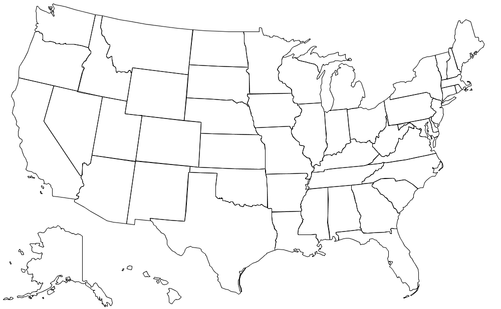

Write a program WorldMap.java that reads boundary information of a country (or 
other geographic entity) from standard input and plots the results to standard 
drawing. A country consists of a set of regions (e.g., states, provinces, or 
other administrative divisions), each of which is described by a polygon.

_Input format._ The first line contains two integers: _width_ and _height_. The 
remaining part of the input is divided into regions.
* The first entry in each region is the name of the region. For simplicity, 
  names will not contain spaces.
* The next entry is an integer specifying the number of vertices in the polygon 
  describing the region.
* Finally, the region contains the x- and y-coordinates of the vertices of the 
  polygon. 


For simplicity, if a region requires more than one polygon to describe its 
boundary, we treat it as multiple regions, with one polygon per region.

_Output format._ Draw the polygons to standard drawing, using the following 
guidelines:
* Call _StdDraw.setCanvasSize()_ to set the size of the canvas to be 
  _width-by-height_ pixels.
* Call _StdDraw.setXscale()_ and _StdDraw.setYscale()_ so that x-coordinates 
  of the canvas range from 0 to _width_ and the y-coordinates range from 0 to 
  _height_.
* Call _StdDraw.polygon()_ to draw each polygon. 

Here are some sample executions for the input files 
[usa.txt](https://github.com/eddycyu/programming-with-a-purpose/blob/master/data/usa.txt){:target="_blank" rel="noopener"},
[russia.txt](https://github.com/eddycyu/programming-with-a-purpose/blob/master/data/russia.txt){:target="_blank" rel="noopener"},
and [world.txt](https://github.com/eddycyu/programming-with-a-purpose/blob/master/data/world.txt){:target="_blank" rel="noopener"}.
Additional input files are available for
[100+ countries](https://coursera.cs.princeton.edu/introcs/assignments/io/files/world/){:target="_blank" rel="noopener"}
and [all 50 U.S. states](https://coursera.cs.princeton.edu/introcs/assignments/io/files/usa/){:target="_blank" rel="noopener"}.

```
~/Desktop/io> javac WorldMap.java

~/Desktop/io> java WorldMap < usa.txt
```


```
~/Desktop/io> java WorldMap < russia.txt
```


```
~/Desktop/io> java WorldMap < world.txt
```


##### Note: the above description is copied from [Coursera](https://coursera.cs.princeton.edu/introcs/assignments/io/specification.php){:target="_blank" rel="noopener"} and converted to markdown for convenience

### Solution:
```java
public class WorldMap {

    public static void main(String[] args) {
        final int width = StdIn.readInt();
        final int height = StdIn.readInt();

        StdDraw.enableDoubleBuffering();
        StdDraw.setCanvasSize(width, height);
        StdDraw.setXscale(0, width);
        StdDraw.setYscale(0, height);
        while (!StdIn.isEmpty()) {
            StdIn.readString();
            final int vertices = StdIn.readInt();
            final double[] x = new double[vertices];
            final double[] y = new double[vertices];
            for (int i = 0; i < vertices; i++) {
                x[i] = StdIn.readDouble();
                y[i] = StdIn.readDouble();
            }
            StdDraw.polygon(x, y);
        }
        StdDraw.show();
    }
}
``` 
Link: [Java Code](https://github.com/eddycyu/programming-with-a-purpose/blob/master/src/WorldMap.java){:target="_blank" rel="noopener"}
