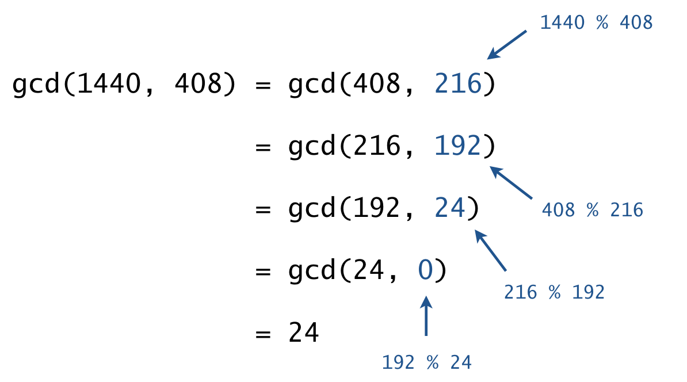
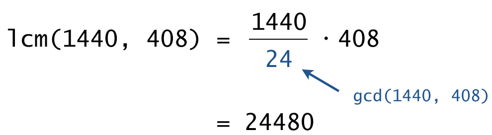

Write a program Divisors.java to compute the greatest common divisor and 
related functions on integers:
* The _greatest common divisor (gcd)_ of two integers _a_ and _b_ is the 
  largest positive integer that is a divisor of both _a_ and _b_. For 
  example, gcd(1440, 408) = 24 because 24 is a divisor of both 1440 and 408 
  (1440 = 24 * 60, 408 = 24 * 17) but no larger integer is a divisor of both. 
  By convention, gcd(0,0) = 0.
* The _least common multiple (lcm)_ of two integers _a_ and _b_ is the 
  smallest positive integer that is a multiple of both _a_ and _b_. For example, 
  lcm(56, 96) = 672 because 672 is a multiple of both 56 and 96 
  (672 = 56 * 7 = 96 * 12) but no smaller positive number is a multiple of both. 
  By convention, if either _a_ or _b_ is 0, then lcm(_a_, _b_) = 0.
* Two integers are _relatively prime_ if they share no positive common divisors 
  (other than 1). For example, 221 and 384 are not relatively prime because 17 
   is a common divisor.
* _Euler’s totient function ϕ(n)_ is the number of integers between 1 and _n_ 
  that are relatively prime with _n_. For example, ϕ(9) = 6 because the six 
  numbers 1, 2, 4, 5, 7, and 8 are relatively prime with 9. Note that if _n_ ≤ 0, 
  then ϕ(_n_) = 0.
  
To do so, organize your program according to the following public API:

```java
public class Divisors {

    // Returns the greatest common divisor of a and b.
    public static int gcd(int a, int b)

    // Returns the least common multiple of a and b.
    public static int lcm(int a, int b)

    // Returns true if a and b are relatively prime; false otherwise.
    public static boolean areRelativelyPrime(int a, int b)

    // Returns the number of integers between 1 and n that are
    // relatively prime with n.
    public static int totient(int n)

    // Takes two integer command-line arguments a and b and prints
    // each function, evaluated in the format (and order) given below.
    public static void main(String[] args)
}
```

Here are some sample executions:

```
~/Desktop/functions> java Divisors 1440 408
gcd(1440, 408) = 24
lcm(1440, 408) = 24480
areRelativelyPrime(1440, 408) = false
totient(1440) = 384
totient(408) = 128

~/Desktop/functions> java Divisors 987 610
gcd(987, 610) = 1
lcm(987, 610) = 602070
areRelativelyPrime(987, 610) = true
totient(987) = 552
totient(610) = 240
```

Use the following algorithms to implement the corresponding functions.

* _Greatest common divisor._ Implement an iterative version of _Euclid's algorithm_. 
  To compute the greatest common divisor of _a_ and _b_:
  * Replace (_a_, _b_) with (abs(_a_), abs(_b_)).
  * Repeatedly replace (_a_, _b_) with (_b_, _a_ % _b_) until the second integer 
    in the pair is zero.
  * Return the first integer in the pair as the gcd.
  
  
  
* _Least common multiple._ Use the following formula, which relates the gcd and 
  lcm functions: lcm(_a_, _b_) = (abs(_a_) * abs(_b_)) / gcd(_a_, _b_)
  To avoid preventable arithmetic overflow, perform the division before the 
  multiplication. Recall that lcm(0, 0) = 0.
  
  

* _Relatively prime._ Two integers _a_ and _b_ are relatively prime if and only 
  if gcd(_a_, _b_) = 1.
* _Euler’s totient function._ Use the definition and call _areRelativelyPrime()_ 
  for each positive integer between 1 and _n_.

The greatest common divisor and least common multiple functions arise in a 
variety of applications, including reducing fractions, modular arithmetic, 
and cryptography. Euler’s totient function plays an important role in number 
theory, including Euler’s theorem and cyclotomic polynomials.
  
##### Note: the above description is copied from [Coursera](https://coursera.cs.princeton.edu/introcs/assignments/functions/specification.php){:target="_blank" rel="noopener"} and converted to markdown for convenience

### Solution:
```java
public class Divisors {

    // Returns the greatest common divisor of a and b.
    public static int gcd(int a, int b) {
        a = Math.abs(a);
        b = Math.abs(b);
        while (b != 0) {
            int mod = a % b;
            a = b;
            b = mod;
        }
        return a;
    }

    // Returns the least common multiple of a and b.
    public static int lcm(int a, int b) {
        if ((a == 0) && (b == 0)) {
            return 0;
        }
        return Math.abs(a) * (Math.abs(b) / gcd(a, b));
    }

    // Returns true if a and b are relatively prime; false otherwise.
    public static boolean areRelativelyPrime(int a, int b) {
        return gcd(a, b) == 1;
    }

    // Returns the number of integers between 1 and n that are
    // relatively prime with n.
    public static int totient(int n) {
        int count = 0;
        for (int i = 0; i < n; i++) {
            if (areRelativelyPrime(i, n)) {
                count++;
            }
        }
        return count;
    }

    public static void main(String[] args) {
        int a = Integer.parseInt(args[0]);
        int b = Integer.parseInt(args[1]);
        StdOut.println("gcd(" + a + "," + b + ") = " + gcd(a, b));
        StdOut.println("lcm(" + a + "," + b + ") = " + lcm(a, b));
        StdOut.println("areRelativelyPrime(" + a + "," + b + ") = " + areRelativelyPrime(a, b));
        StdOut.println("totient(" + a + ") = " + totient(a));
        StdOut.println("totient(" + b + ") = " + totient(b));
    }
}
``` 
Link To: [Java Source Code](https://github.com/eddycyu/programming-with-a-purpose/blob/master/src/Divisors.java){:target="_blank" rel="noopener"}
