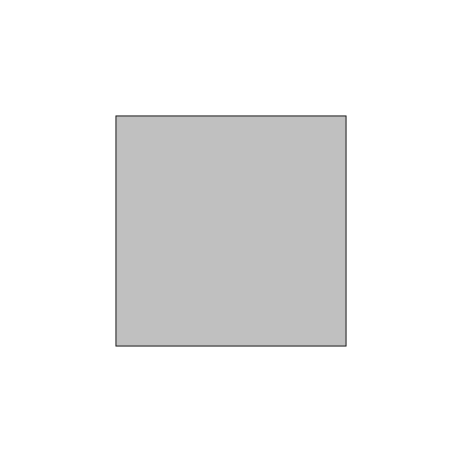
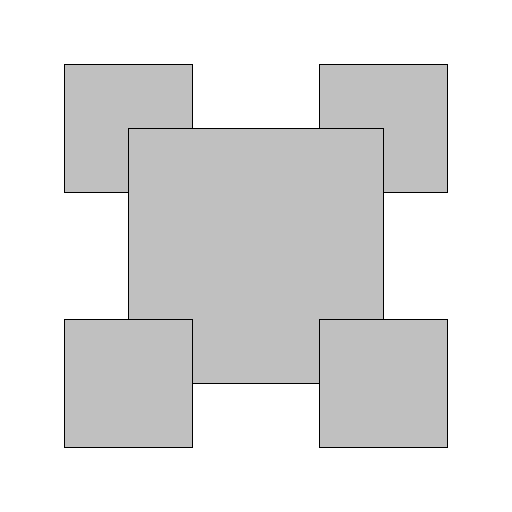
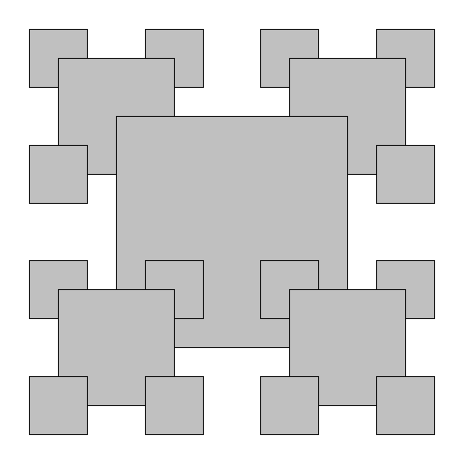

Write a program RecursiveSquares.java that takes an integer command-line 
argument _n_ and plots a recursive square pattern of order _n_.






To do so, organize your program according to the following public API:

```java
public class RecursiveSquares {

    // Draws a square centered on (x, y) of the given side length
    // with a light gray background and a black border.
    public static void drawSquare(double x, double y, double length)

    // Draws a recursive square pattern of order n, centered on (x, y)
    // of the given side length.
    public static void draw(int n, double x, double y, double length)

    // Takes an integer command-line argument n and draws a recursive
    // square pattern of order n, centered on (0.5, 0.5) with side length 0.5.
    public static void main(String[] args)
}
```

The largest square is centered on the canvas and has side length 0.5. The side 
length of each square is one-half that of the next largest square.

```
~/Desktop/recursion> java RecursiveSquares 2
```


```
~/Desktop/recursion> java RecursiveSquares 4
```  


Note: you may assume that _n_ is a non-negative integer.

##### Note: the above description is copied from [Coursera](https://coursera.cs.princeton.edu/introcs/assignments/recursion/specification.php){:target="_blank" rel="noopener"} and converted to markdown for convenience

### Solution:
```java
public class RecursiveSquares {

    // Draws a square centered on (x, y) of the given side length
    // with a light gray background and a black border.
    public static void drawSquare(double x, double y, double length) {
        // draw filled square
        StdDraw.setPenColor(Color.LIGHT_GRAY);
        StdDraw.filledSquare(x, y, length / 2.0);
        // draw border
        StdDraw.setPenColor(Color.BLACK);
        StdDraw.square(x, y, length / 2);
    }

    // Draws a recursive square pattern of order n, centered on (x, y)
    // of the given side length.
    public static void draw(int n, double x, double y, double length) {
        if (n == 0) {
            return;
        }

        // lower left and lower right
        double x01 = x - (length / 2);
        double y01 = y - (length / 2);
        double x02 = x + (length / 2);
        double y02 = y - (length / 2);
        // uppper left and upper right
        double x11 = x - (length / 2);
        double y11 = y + (length / 2);
        double x12 = x + (length / 2);
        double y12 = y + (length / 2);

        // draw from upper left to lower right
        draw(n - 1, x11, y11, length / 2);    // upper left
        draw(n - 1, x12, y12, length / 2);    // upper right
        drawSquare(x, y, length);
        draw(n - 1, x01, y01, length / 2);    // lower left
        draw(n - 1, x02, y02, length / 2);    // lower right
    }

    // Takes an integer command-line argument n and draws a recursive
    // square pattern of order n, centered on (0.5, 0.5) with side length 0.5.
    public static void main(String[] args) {
        final int n = Integer.parseInt(args[0]);
        draw(n, 0.5, 0.5, 0.5);
    }
}
``` 
Link: [Java Code](https://github.com/eddycyu/programming-with-a-purpose/blob/master/src/RecursiveSquares.java){:target="_blank" rel="noopener"}
