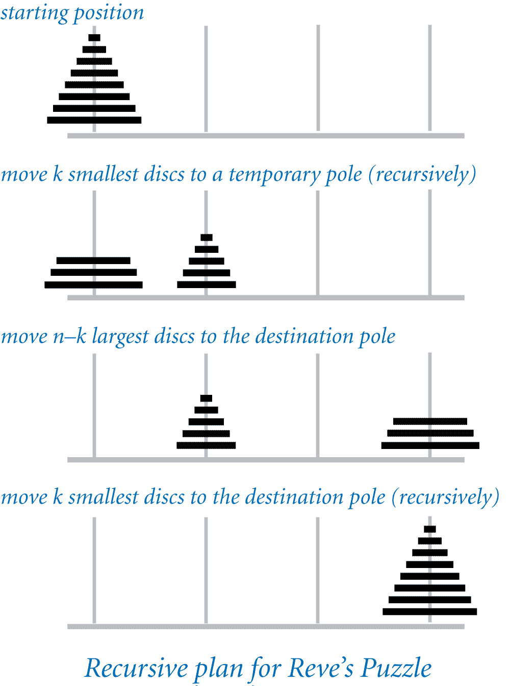

Reve's puzzle is identical to the towers of Hanoi problem, except that there 
are 4 poles (instead of 3). The task is to move _n_ discs of different sizes 
from the starting pole to the destination pole, while obeying the following 
rules:

* Move only one disc at a time.
* Never place a larger disc on a smaller one.

The following remarkable algorithm, discovered by Frame and Stewart in 1941, 
transfers _n_ discs from the starting pole to the destination pole using the 
fewest moves (although this fact was not proven until 2014).

* Let _k_ denote the integer nearest to _n_ + 1 − sqrt(2_n_ + 1).
* Transfer (recursively) the _k_ smallest discs to a single pole other than 
  the start or destination poles.
* Transfer the remaining _n − k_ disks to the destination pole (without using 
  the pole that now contains the smallest _k_ discs). To do so, use the 
  algorithm for the 3-pole towers of Hanoi problem.
* Transfer (recursively) the _k_ smallest discs to the destination pole.



Write a program RevesPuzzle.java that takes an integer command-line argument 
_n_ and prints a solution to Reve’s puzzle. Assume that the the discs are 
labeled in increasing order of size from 1 to _n_ and that the poles are 
labeled _A_, _B_, _C_, and _D_, with _A_ representing the starting pole and 
_D_ representing the destination pole. Here are a few sample executions:

```
~/Desktop/recursion> java RevesPuzzle 3
Move disc 1 from A to B
Move disc 2 from A to C
Move disc 3 from A to D
Move disc 2 from C to D
Move disc 1 from B to D

~/Desktop/recursion> java RevesPuzzle 4
Move disc 1 from A to D
Move disc 2 from A to B
Move disc 1 from D to B
Move disc 3 from A to C
Move disc 4 from A to D
Move disc 3 from C to D
Move disc 1 from B to A
Move disc 2 from B to D
Move disc 1 from A to D

~/Desktop/recursion> java RevesPuzzle 5
Move disc 1 from A to D
Move disc 2 from A to C
Move disc 3 from A to B
Move disc 2 from C to B
Move disc 1 from D to B
Move disc 4 from A to C
Move disc 5 from A to D
Move disc 4 from C to D
Move disc 1 from B to A
Move disc 2 from B to C
Move disc 3 from B to D
Move disc 2 from C to D
Move disc 1 from A to D
```

Note: you may assume that _n_ is a positive integer.

Recall that for the towers of Hanoi problem, the minimum number of moves for a 
64-disc problem is 2<sup>64</sup> − 1. With the addition of a fourth pole, the 
minimum number of moves for a 64-disc problem is reduced to 18,433.
  
##### Note: the above description is copied from [Coursera](https://coursera.cs.princeton.edu/introcs/assignments/recursion/specification.php){:target="_blank" rel="noopener"} and converted to markdown for convenience

### Solution:
```java
public class RevesPuzzle {

    private static void reves(int n, char a, char b, char c, char d) {
        if (n == 1) {
            StdOut.println("Move disc " + n + " from " + a + " to " + d);
            return;
        }

        final int k = (int) Math.round(n + 1.0 - (Math.sqrt((2 * n) + 1.0)));
        // transfer k smallest discs from (A) to single pole (B) 
        // other than start or destination pole
        reves(k, a, c, d, b);
        // transfer remaining n-k discs from (A) to destination (D) 
        // and skip (B)
        hanoi(n, k, a, c, d);
        // transfer k smallest discs from (B) to destination (D)
        reves(k, b, a, c, d);

    }

    private static void hanoi(int n, int k, char start, char mid, char end) {
        if ((n == 0) || (n <= k)) {
            return;
        }
        hanoi(n - 1, k, start, end, mid);
        StdOut.println("Move disc " + n + " from " + start + " to " + end);
        hanoi(n - 1, k, mid, start, end);
    }

    public static void main(String[] args) {
        final int n = Integer.parseInt(args[0]);
        reves(n, 'A', 'B', 'C', 'D');
    }
}
``` 
Link: [Java Code](https://github.com/eddycyu/programming-with-a-purpose/blob/master/src/RevesPuzzle.java){:target="_blank" rel="noopener"}
