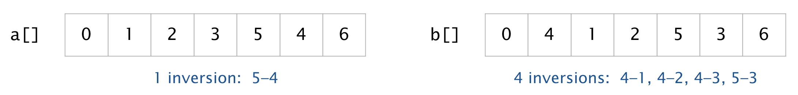

Suppose that a music site wants to compare your song preferences to those of a 
friend. One approach is to have you and your friend each rank a set of _n_ 
songs and count the number of pairs of songs (_i_, _j_) for which you prefer 
_i_ to _j_ but your friend prefers _j_ to _i_. When the count is low, the 
preferences are similar. 

More generally, given an array of integers, a pair of elements a[_i_] and 
a[_j_] are inverted if _i_ < _j_ and a[_i_] > a[_j_]. For example, the array 
a[ ] has 1 inversion and the array b[ ] has 4 inversions.

<br/>

Write a program Inversions.java that implements the following API:

```java
public class Inversions {

    // Return the number of inversions in the permutation a[].
    public static long count(int[] a)

    // Return a permutation of length n with exactly k inversions.
    public static int[] generate(int n, long k)

    // Takes an integer n and a long k as command-line arguments,
    // and prints a permutation of length n with exactly k inversions.
    public static void main(String[] args)
}
```

Here is some more information about the required behavior:

* _Permutations._ A permutation of length _n_ is an integer array of length _n_ 
  that contains each of the _n_ integers 0, 1, ..., _n_ – 1 exactly once.
* _Output format._ The _main()_ method should print the permutation of length 
  _n_ to standard output as a sequence of _n_ integers, separated by whitespace, 
  all on one line.
* _Performance._ The _count()_ method should take time proportional to 
  _n<sup>2</sup>_ in the worst case. The _generate()_ method should take time 
  proportional to _n_ in the worst case.
* _Corner cases._ You may assume that the arguments to _generate()_ satsify 
  _n_ ≥ 0 and 0 ≤ _k_ ≤ 12_n_(_n_ − 1); this guarantees the existence of a 
  permutation of length _n_ with exactly _k_ inversions.

Here are a few sample executions:

```
~/Desktop/performance> java Inversions 10 0
0 1 2 3 4 5 6 7 8 9

~/Desktop/performance> java Inversions 10 1
0 1 2 3 4 5 6 7 9 8

~/Desktop/performance> java Inversions 10 45
9 8 7 6 5 4 3 2 1 0

~/Desktop/performance> java Inversions 10 20
9 8 0 1 2 3 7 4 5 6
```

Counting inversions arise in a number of applications, including sorting, 
voting theory, collaborative filtering, rank aggregation, and non-parametric 
statistics.

##### Note: the above description is copied from [Coursera](https://coursera.cs.princeton.edu/introcs/assignments/performance/specification.php){:target="_blank" rel="noopener"} and converted to markdown for convenience

### Solution:
```java
public class Inversions {

    // Return the number of inversions in the permutation a[].
    // Max time complexity = O(n2)
    public static long count(int[] a) {
        long count = 0;
        for (int i = 0; i < a.length; i++) {
            for (int j = i + 1; j < a.length; j++) {
                if (a[i] > a[j]) {
                    count++;
                }
            }
        }
        return count;
    }

    // Return a permutation of length n with exactly k inversions.
    // Max time complexity = O(n)
    public static int[] generate(int n, long k) {
        // generate starting sequence of length n with no inversions
        final int[] a = new int[n];
        for (int i = 0; i < n; i++) {
            a[i] = i;
        }

        // nothing to do
        if (k == 0) {
            return a;
        }

        /**
         * Example:
         *
         * n = 6
         *
         * 0 1 2 3 4 5 -> 5 0 1 2 3 4 == 5 inversions  (1 swap)
         * 5 0 1 2 3 4 -> 5 4 0 1 2 3 == 9 inversions  (2 swaps)
         * 5 4 0 1 2 3 -> 5 4 3 0 1 2 == 12 inversions (3 swaps)
         * 5 4 3 0 1 2 -> 5 4 3 2 0 1 == 14 inversions (4 swaps)
         * 5 4 3 2 0 1 -> 5 4 3 2 1 0 == 15 inversions (5 swaps)
         */

        // compute the number of swaps (as shown above example)
        int minSwap = 0;
        int inversionCount = 0;
        for (int i = 1; i < n; i++) {
            final int newInversions = (n - i);
            if ((inversionCount + newInversions) <= k) {
                minSwap++;
                inversionCount += newInversions;
            } else {
                break;
            }
        }
        // perform min swaps (bulk inversions)
        for (int i = 0; i < minSwap; i++) {
            a[i] = (n - 1) - i;
        }
        // fill in remaining numbers
        for (int i = 0; i < (n - minSwap); i++) {
            a[minSwap + i] = i;
        }
        // do remining individual inversions
        for (int i = 0; (i < (n - minSwap)) && (inversionCount < k); i++) {
            for (int j = i + 1; (j < (n - minSwap)) && (inversionCount < k); j++) {
                // swap to create inversion
                final int temp = a[minSwap + i];
                a[minSwap + i] = a[minSwap + j];
                a[minSwap + j] = temp;
                inversionCount++;
            }
        }
        return a;
    }

    // Takes an integer n and a long k as command-line arguments,
    // and prints a permutation of length n with exactly k inversions.
    public static void main(String[] args) {
        final int n = Integer.parseInt(args[0]);
        final long k = Long.parseLong(args[1]);
        final int[] a = generate(n, k);
        for (int i = 0; i < a.length; i++) {
            StdOut.print(a[i] + " ");
        }
    }
}
``` 
Link: [Java Code](https://github.com/eddycyu/programming-with-a-purpose/blob/master/src/Inversions.java){:target="_blank" rel="noopener"}
