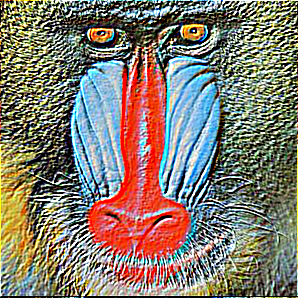

Write an image-processing library KernelFilter.java that applies various kernel 
filters to images, such as Gaussian blur, sharpen, Laplacian, emboss, and 
motion blur. A [kernel filter](https://setosa.io/ev/image-kernels/){:target="_blank" rel="noopener"}
modifies the pixels in an image by replacing each pixel with a linear 
combination of its neighboring pixels. The matrix that characterizes the linear 
combination is known as the kernel.

More specifically, to apply a kernel filter to a grayscale image, perform the 
following operation for each pixel p:
* Align the center of the kernel on pixel _p_.
* The new grayscale value of pixel _p_ is obtained by multiplying each kernel 
  element with the corresponding grayscale value, and adding the results.
  
  <br/>

To apply a kernel filter to a color image, perform the above operation to the 
red, green, and blue components of each pixel _p_ separately, and combine the 
results.

The following table describes the kernel filters that you will implement and 
illustrates the results using a classic test image
[(baboon.png)](https://github.com/eddycyu/programming-with-a-purpose/blob/master/data/baboon.png){:target="_blank" rel="noopener"}:

image filter  | kernel | result
--------------|--------|-------
identity      | \|0 0 0\|<br>\|0 1 0\|<br/>\|0 0 0\| | <br/>
Gaussian blur | \|1 2 1\|<br>\|2 4 2\| * (1/16)<br/>\|1 2 1\| | <br/>
sharpen       | \|&nbsp;0 -1 &nbsp;0\|<br>\|-1 &nbsp;5 -1\|<br/>\|&nbsp;0 -1 &nbsp;0\| | <br/>
Laplacian     | \|-1 -1 -1\|<br>\|-1 &nbsp;8 -1\|<br/>\|-1 -1 -1\| | <br/>
emboss        | \|-2 -1 0\|<br>\|-1 &nbsp;1 1\|<br/>\|&nbsp;0 &nbsp;1 2\| | <br/>
motion blur   | \|1 0 0 0 0 0 0 0 0\|<br>\|0 1 0 0 0 0 0 0 0\|<br/>\|0 0 1 0 0 0 0 0 0\|<br/>\|0 0 0 1 0 0 0 0 0\|<br/>\|0 0 0 0 1 0 0 0 0\| * (1/9)<br/>\|0 0 0 0 0 1 0 0 0\|<br/>\|0 0 0 0 0 0 1 0 0\|<br/>\|0 0 0 0 0 0 0 1 0\|<br/>\|0 0 0 0 0 0 0 0 1\| | <br/>

To do so, implement the following public API:

```java
public class KernelFilter {

    // Returns a new picture that applies the identity filter to the given picture.
    public static Picture identity(Picture picture)

    // Returns a new picture that applies a Gaussian blur filter to the given picture.
    public static Picture gaussian(Picture picture)

    // Returns a new picture that applies a sharpen filter to the given picture.
    public static Picture sharpen(Picture picture)

    // Returns a new picture that applies an Laplacian filter to the given picture.
    public static Picture laplacian(Picture picture)

    // Returns a new picture that applies an emboss filter to the given picture.
    public static Picture emboss(Picture picture)

    // Returns a new picture that applies a motion blur filter to the given picture.
    public static Picture motionBlur(Picture picture)

    // Test client (ungraded).
    public static void main(String[] args)
}
```

Here is some more information about the required behavior:
* _Periodic boundary conditions._ When applying a kernel filter to a pixel near 
  the boundary, some of its neighboring pixels may not exist. In such cases, 
  assume the leftmost column wraps around to the rightmost column and the top 
  row wraps around to the bottom row (and vice versa).
  
  <br/>
* _Rounding._ When applying a kernel filter, the resulting RGB components may 
  become fractional if the kernel weights are fractional. Round each RGB 
  component to the nearest integer, with ties rounding up.
* _Clamping._ When applying a kernel filter, the resulting RGB components may 
  not remain between 0 and 255. If an RGB component of a pixel is less than 0, 
  set it to 0; if is greater than 255, set it to 255. This mechanism for 
  handling arithmetic overflow and underflow is known as clamping or saturating arithmetic.
* _Test client._ Your _main()_ method should test each of your public methods.
* _Performance requirement._ All methods should take time proportional to the 
  product of the number of pixels in the image and the number of elements in 
  the kernel.

Kernel filters are widely used for image processing in applications such as 
Photoshop or GIMP. They are also used in convolutional neural networks to 
extract features from an image and in digital cameras to remove camera shake.

##### Note: the above description is copied from [Coursera](https://coursera.cs.princeton.edu/introcs/assignments/oop1/specification.php){:target="_blank" rel="noopener"} and converted to markdown for convenience

### Solution:
```java
public class KernelFilter {

    private static int wrap(int index, int max) {
        if (index < 0) {
            // wrap from left to right
            if (max == 1) {
                return 0;
            } else {
                return max + (index % max);
            }
        } else if (index >= max) {
            // wrap from right to left
            if (max == 1) {
                return 0;
            } else {
                return index % max;
            }
        } else {
            return index;
        }
    }

    private static int roundAndClamp(double value) {
        long result = Math.round(value);
        if (result < 0) {
            return 0;
        } else if (result > 255) {
            return 255;
        } else {
            return (int) result;
        }
    }

    private static Picture applyFilter(Picture picture, int[][] filter, double multiplier) {
        final int width = picture.width();
        final int height = picture.height();
        final Picture result = new Picture(picture);
        // iterate through the picture
        for (int row = 0; row < height; row++) {
            for (int col = 0; col < width; col++) {
                int newR = 0, newG = 0, newB = 0;
                int mid = filter.length / 2;
                // iterate through the filter
                for (int i = -mid; i <= mid; i++) {
                    for (int j = -mid; j <= mid; j++) {
                        final Color color = picture.get(wrap(col + j, width), wrap(row + i, height));
                        final int r = color.getRed();
                        final int g = color.getGreen();
                        final int b = color.getBlue();
                        newR += (r * filter[i + mid][j + mid]);
                        newG += (g * filter[i + mid][j + mid]);
                        newB += (b * filter[i + mid][j + mid]);
                    }
                }
                newR = roundAndClamp(newR * multiplier);
                newG = roundAndClamp(newG * multiplier);
                newB = roundAndClamp(newB * multiplier);
                final Color newColor = new Color(newR, newG, newB);
                result.set(col, row, newColor);
            }
        }
        return result;
    }

    // Returns a new picture that applies the identity filter to the given picture.
    public static Picture identity(Picture picture) {
        final int[][] filter = {
                {0, 0, 0},
                {0, 1, 0},
                {0, 0, 0}};
        return applyFilter(picture, filter, 1);
    }

    // Returns a new picture that applies a Gaussian blur filter to the given picture.
    public static Picture gaussian(Picture picture) {
        final int[][] filter = {
                {1, 2, 1},
                {2, 4, 2},
                {1, 2, 1}};
        return applyFilter(picture, filter, 1.0 / 16.0);
    }

    // Returns a new picture that applies a sharpen filter to the given picture.
    public static Picture sharpen(Picture picture) {
        final int[][] filter = {
                {0, -1, 0},
                {-1, 5, -1},
                {0, -1, 0}};
        return applyFilter(picture, filter, 1);
    }

    // Returns a new picture that applies an Laplacian filter to the given picture.
    public static Picture laplacian(Picture picture) {
        final int[][] filter = {
                {-1, -1, -1},
                {-1, 8, -1},
                {-1, -1, -1}};
        return applyFilter(picture, filter, 1);
    }

    // Returns a new picture that applies an emboss filter to the given picture.
    public static Picture emboss(Picture picture) {
        final int[][] filter = {
                {-2, -1, 0},
                {-1, 1, 1},
                {0, 1, 2}};
        return applyFilter(picture, filter, 1);
    }

    // Returns a new picture that applies a motion blur filter to the given picture.
    public static Picture motionBlur(Picture picture) {
        final int[][] filter = {
                {1, 0, 0, 0, 0, 0, 0, 0, 0},
                {0, 1, 0, 0, 0, 0, 0, 0, 0},
                {0, 0, 1, 0, 0, 0, 0, 0, 0},
                {0, 0, 0, 1, 0, 0, 0, 0, 0},
                {0, 0, 0, 0, 1, 0, 0, 0, 0},
                {0, 0, 0, 0, 0, 1, 0, 0, 0},
                {0, 0, 0, 0, 0, 0, 1, 0, 0},
                {0, 0, 0, 0, 0, 0, 0, 1, 0},
                {0, 0, 0, 0, 0, 0, 0, 0, 1}};
        return applyFilter(picture, filter, 1.0 / 9.0);
    }

    // Test client (ungraded).
    public static void main(String[] args) {
        Picture picture = new Picture(args[0]);
        identity(picture).show();
        gaussian(picture).show();
        sharpen(picture).show();
        laplacian(picture).show();
        emboss(picture).show();
        motionBlur(picture).show();
    }
}
``` 
Link To: [Java Source Code](https://github.com/eddycyu/programming-with-a-purpose/blob/master/src/KernelFilter.java){:target="_blank" rel="noopener"}
