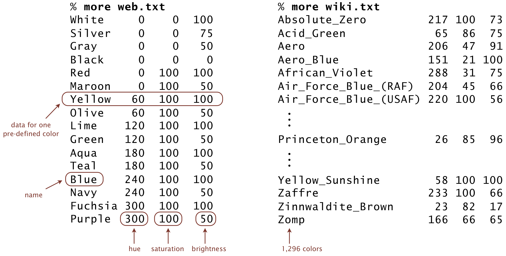

Write a data type ColorHSB.java that represents a color in 
hue–saturation–brightness (HSB) format, along with a sample client. The HSB 
color format is widely used in color pickers.
```
HSB = (240°, 100%, 100%)
```

A color in HSB format is composed of three components:
* The hue is an integer between 0 and 359. It represents a pure color on the 
  color wheel, with 0° for red, 120° for green, and 240° for blue.
* The saturation is an integer between 0 and 100. It represents the purity of 
  the hue.
* The brightness is an integer between 0 and 100. It represents the percentage 
  of white that is mixed with the hue.

Implement the following public API:

```java
public class ColorHSB {

    // Creates a color with hue h, saturation s, and brightness b.
    public ColorHSB(int h, int s, int b)

    // Returns a string representation of this color, using the format (h, s, b).
    public String toString()

    // Is this color a shade of gray?
    public boolean isGrayscale()

    // Returns the squared distance between the two colors.
    public int distanceSquaredTo(ColorHSB that)

    // Sample client (see below).
    public static void main(String[] args)
}
```

Here is some more information about the required behavior:
* _Corner cases._ Throw an _IllegalArgumentException_ in the constructor if any 
  component is outside its prescribed range (0 to 359 for the hue, 0 to 100 for 
  the saturation and brightness); throw an _IllegalArgumentException_ in 
  _distanceSquaredTo()_ if its argument is _null_.
* _String representation._ Return a string composed of the integers for hue, 
  saturation, and brightness (in that order), separated by commas, and enclosed 
  in parentheses. An example is (26, 85, 96).
* _Grayscale._ A color in HSB format is a shade of gray if either its 
  saturation or brightness component is 0% (or both).
* _Distance._ The squared distance between two colors (h1,s1,b1) and (h2,s2,b2) 
  is defined to be
  
  min { (_h_<sub>1</sub> − _h_<sub>2</sub>) <sup>2</sup> , (360 − \|_h_<sub>1</sub> − _h_<sub>2</sub>\|) <sup>2</sup> } + (_s_<sub>1</sub> − _s_<sub>2</sub>) <sup>2</sup> + (_b_<sub>1</sub> − _b_<sub>2</sub>) <sup>2</sup>

  For example, the squared distance between (350, 100, 45) and (0, 100, 50) is 
  10 <sup>2</sup> + 0 <sup>2</sup> + 52 = 125.
* _Sample client._ The _main()_ method should take three integer command-line 
  arguments _h_, _s_, and _b_; read a list of pre-defined colors from standard 
  input; and print to standard output the pre-defined color that is closest to 
  (h,s,b).
  
  * _Input specification._ The input from standard input consists of a sequence 
    of one or more lines. Each line contains a string (the name of a 
    pre-defined color) and three integers (its hue, saturation, and brightness 
    components), separated by whitespace. The data files 
    [web.txt](https://github.com/eddycyu/programming-with-a-purpose/blob/master/data/web.txt){:target="_blank" rel="noopener"}
    and [web.txt](https://github.com/eddycyu/programming-with-a-purpose/blob/master/data/wiki.txt){:target="_blank" rel="noopener"}
    are in the specified format.

    <br/>
    
  * _Output specification._ The output to standard output consists of one 
    line: the name of the nearest pre-defined color and the string 
    representation of that color, separated by whitespace.
    
```
~/Desktop/oop2> java ColorHSB 25 84 97 < web.txt
Red (0, 100, 100)

~/Desktop/oop2> java ColorHSB 350 100 45 < web.txt
Maroon (0, 100, 50)

~/Desktop/oop2> java ColorHSB 25 84 97 < wiki.txt
Princeton_Orange (26, 85, 96)
```

##### Note: the above description is copied from [Coursera](https://coursera.cs.princeton.edu/introcs/assignments/oop2/specification.php){:target="_blank" rel="noopener"} and converted to markdown for convenience

### Solution:
```java
public class ColorHSB {

    private static final int MAX_HUE = 359;
    private static final int MAX_SATURATION = 100;
    private static final int MAX_BRIGHTNESS = 100;

    private final int hue;          // 0...359, 0 = red, 120 = green, 24 = blue
    private final int saturation;   // 0...100
    private final int brightness;   // 0...100

    // Creates a color with hue h, saturation s, and brightness b.
    public ColorHSB(int h, int s, int b) {
        if ((h < 0) || (h > MAX_HUE)) {
            throw new IllegalArgumentException();
        }
        if ((s < 0) || (s > MAX_SATURATION)) {
            throw new IllegalArgumentException();
        }
        if ((b < 0) || (b > MAX_BRIGHTNESS)) {
            throw new IllegalArgumentException();
        }
        hue = h;
        saturation = s;
        brightness = b;
    }

    // Returns a string representation of this color, using the format (h, s, b).
    public String toString() {
        return "(" + hue + ", " + saturation + ", " + brightness + ")";
    }

    // Is this color a shade of gray?
    public boolean isGrayscale() {
        return (saturation == 0) || (brightness == 0);
    }

    // Returns the squared distance between the two colors.
    public int distanceSquaredTo(ColorHSB that) {
        if (that == null) {
            throw new IllegalArgumentException();
        }
        return (int) (Math.min(Math.pow(hue - that.hue, 2), Math.pow(360 - Math.abs(hue - that.hue), 2))
                + Math.pow(saturation - that.saturation, 2)
                + Math.pow(brightness - that.brightness, 2));
    }

    // Sample client (see below).
    public static void main(String[] args) {
        final int h = Integer.parseInt(args[0]);
        final int s = Integer.parseInt(args[1]);
        final int b = Integer.parseInt(args[2]);
        final ColorHSB colorHSB1 = new ColorHSB(h, s, b);
        int closestDistance = Integer.MAX_VALUE;
        String closestColorName = null;
        ColorHSB closestColorHSB = null;
        while (StdIn.hasNextLine() && !StdIn.isEmpty()) {
            final String colorName = StdIn.readString();
            final int h2 = StdIn.readInt();
            final int s2 = StdIn.readInt();
            final int b2 = StdIn.readInt();
            final ColorHSB colorHSB2 = new ColorHSB(h2, s2, b2);
            final int distance = colorHSB1.distanceSquaredTo(colorHSB2);
            if (distance < closestDistance) {
                closestDistance = distance;
                closestColorName = colorName;
                closestColorHSB = colorHSB2;
            }
        }
        StdOut.println(closestColorName + " " + closestColorHSB);
    }
}
``` 
Link To: [Java Source Code](https://github.com/eddycyu/programming-with-a-purpose/blob/master/src/ColorHSB.java){:target="_blank" rel="noopener"}
